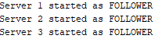
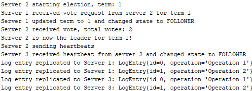
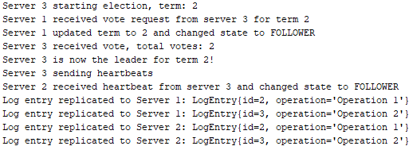

# Code-Overview
This simulation provides a basic implementation of the **RAFT algorithm**. It includes a RAFTServer class that represents each server in the cluster, a LogEntry class to model log entries, and a simple main class for running the simulation.   Here you can find a brief description of all the classes and their attributes and methods: 

**RAFTServer** Class:   
Represents a Server in the RAFT-Cluster. Key components include:

Enum defines the possible states of a Server:

- _FOLLOWER_: A server that is following a leader.
- _CANDIDATE_: A server that is running for leadership.
- _LEADER_: A server that leads the cluster and manages log replication.

Fields: 

- _state_: Current state of the server (FOLLOWER, CANDIDATE, LEADER).
- _term_: Logical time period used to maintain consistency across the distributed system.
- _votes_: Number of votes received by the server during an election.
- _id_: Unique identifier for the server.
- _log_: List of log entries.
- _executor_: ScheduledExecutorService for handling time-based tasks.
- _electionFuture_: Reference to a scheduled election task.

Methods:

- _getRandomTimeout()_: Generates a random timeout value within a specified range for election timeouts.
- _start()_: Initializes the server, sets its state to FOLLOWER, and schedules an election timeout.
- _startElection()_: Transitions the server to CANDIDATE state, initiates an election by requesting votes, and schedules the next election timeout.
- _requestVote(RAFTServer candidate)_: Processes a vote request from another server, updates its term, and grants a vote if eligible.
- _receiveVote()_: Increments the vote count and transitions to LEADER state if a majority of votes is received.
- _becomeLeader()_: Transitions the server to LEADER state, starts sending heartbeats, and replicates log entries to followers.
- _sendHeartbeats()_: Sends heartbeat messages to all follower servers to maintain leadership and prevent new elections.
- _receiveHeartbeat(RAFTServer leader)_: Updates the server's term and state if it receives a heartbeat from a server with a higher term.
- _replicateLogEntries()_: Simulates the replication of log entries from the leader to follower servers.
- _addServer(RAFTServer server)_: Adds a server to the cluster.
- _shutdown()_: Shuts down the executor service.   

**LogEntry** Class:   
Models a log entry in the RAFT system:

Fields:

- _id_: Unique identifier for the log entry.
- _operation_: Description of the operation represented by the log entry.
- _Constructor_: Initializes a log entry with an operation. 

Methods:

- _toString()_ : Provides a string representation of the log entry for display purposes.  

**main** Class:  
Contains the main method for running the simulation:

- _Creates Instances_: Initializes three servers (s1, s2, s3).
- _Adds Servers to Cluster_: Adds servers to the RAFT cluster.
- _Starts Servers_: Starts each server.
- _Runs Simulation_: Allows the simulation to run for 15 seconds.
- _Shutdown_: Shuts down the executor services for all servers   

**Testing Highlights: Initial Server Startup**
  

  

All three servers (Server 1, Server 2, and Server 3) have initialized and started in the FOLLOWER state. This is the default state for all servers when the system starts, where they wait for a leader to be elected.  

**Testing Highlights: Election and Leader Transition**
  

  

- _Election Start_: Server 2 initiates an election for term 1.
- _Vote Request_: Server 1 receives a vote request from Server 2 for term 1 and updates its term to 1, changing its state to FOLLOWER.
- _Vote Granting_: Server 2 receives the necessary votes (including its own) and is elected as the leader for term 1.
- _Heartbeat Sending_: Server 2 begins sending heartbeats to other servers to assert its leadership.
- _State Change_: Server 3 receives the heartbeat from Server 2 and changes its state to FOLLOWER.
- _Log Replication_: Log entries created by Server 2 are replicated to both Server 1 and Server 3.  
  
**Testing Highlights: Re-Election and New Leader**
  

  

- _Election Start_: Server 3 initiates an election for term 2.
- _Vote Request_: Server 1 receives a vote request from Server 3 for term 2 and updates its term to 2, changing its state to FOLLOWER.
- _Vote Granting_: Server 3 receives the necessary votes and is elected as the new leader for term 2.
- _Heartbeat Sending_: Server 3 begins sending heartbeats to other servers to assert its leadership.
- _State Change_: Server 2 receives the heartbeat from Server 3 and changes its state to FOLLOWER.
- _Log Replication_: Log entries created by Server 3 are replicated to both Server 1 and Server 2.  

All the code in this repository is commented to provide additional information and context. If you need any details or explanations, please refer to the comments within the code.
For seeing an implementation which has been enhanced to simulate real-world distributed systems check [RAFT-Algorithm-Full-Features](https://github.com/Moret00/RAFT-Algorithm-Full-Features).
